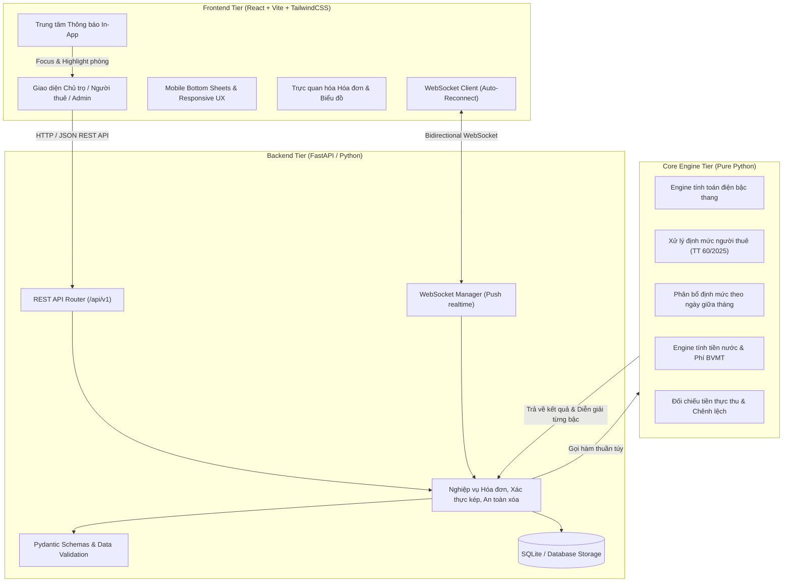

# tro. — Hệ thống tính toán và đối chiếu chi phí điện nước nhà trọ minh bạch
[](https://github.com/tuanhung075021/tro/actions/workflows/ci.yml)
[](https://opensource.org/licenses/MIT)
[](https://www.python.org/)
[](https://nodejs.org/)
[](CONTRIBUTING.md)
[](LICENSE)

> **tro.** là dự án phần mềm nguồn mở (FOSS) phục vụ cộng đồng người thuê nhà và các chủ cơ sở cho thuê, giúp tính toán chính xác chi phí điện, nước sinh hoạt theo đúng quy định pháp luật hiện hành của Việt Nam, cung cấp cơ chế đối chiếu minh bạch từng bậc giá và phát hiện các khoản thu vượt quy định.

---

## 1. Đặt vấn đề & Mục tiêu thực tiễn

Trên thực tế tại các đô thị lớn, sinh viên và người lao động thuê trọ thường xuyên phải chi trả tiền điện sinh hoạt theo **đơn giá phẳng cố định rất cao** (phổ biến từ 4.000 đến 4.500 đồng/kWh) — mức giá này thậm chí cao hơn cả đơn giá bậc cao nhất (bậc 6: 3.460 đồng/kWh) trong biểu giá bán lẻ của Nhà nước. Đồng thời, người thuê trọ thường gặp các rào cản:
- Không được tiếp cận công tơ tổng hoặc khó kiểm chứng số đo công tơ riêng.
- Không nắm rõ biểu giá bậc thang và số định mức mình được hưởng theo quy định.
- Thiếu công cụ độc lập, trực quan để diễn giải chi tiết cách tính hóa đơn và tính toán số tiền chênh lệch đang phải trả thừa.

**Dự án `tro.` ra đời nhằm giải quyết triệt để vấn đề trên**:
1. **Minh bạch hóa cách tính**: Cung cấp công cụ tính toán chính xác tiền điện, nước theo định mức và biểu giá bậc thang, diễn giải chi tiết từng bậc sản lượng và tiền thuế VAT.
2. **Đối chiếu độc lập**: So sánh giữa phương án tính đúng quy định (có định mức hoặc áp bậc 3) với số tiền thực thu của chủ nhà để chỉ rõ khoản chênh lệch.
3. **Cấu hình số người xác thực kép (Dual-Approval)**: Thay thế hoàn toàn "báo sai định mức" bằng cơ chế hai bên chủ trọ - người thuê đề xuất và phê duyệt chéo, bắt buộc nhập mật khẩu cá nhân để xác thực.
4. **Phân bổ định mức giữa tháng (Prorated)**: Tự động tính toán định mức lũy tiến bậc thang theo tỷ lệ số ngày thực tế trong tháng khi có biến động người ở theo Thông tư 60/2025/TT-BCT.
5. **Xóa phòng & Khu trọ an toàn**: Ngăn chặn rủi ro mất dữ liệu với ràng buộc phòng phải trống và xác thực mật khẩu chủ trọ trước khi xóa.
6. **Hệ thống Quản trị & Biểu giá tập trung**: Admin có thể quản trị biểu giá nhà nước qua các thời kỳ, lưu vết `TariffChangeLog`, duyệt yêu cầu admin và xoay vòng secret key an toàn.
7. **Real-time WebSocket & Thông báo tức thời**: Cập nhật trạng thái hóa đơn, đề xuất định mức tức thì không cần reload trang; bấm vào thông báo tự động cuộn và highlight phòng liên quan.
8. **Trải nghiệm Mobile-First Native**: Chuyển toàn bộ các modal sang Mobile Bottom Sheet, vuốt chạm một tay dễ dàng, chống tràn ngang tuyệt đối.

---

## 2. Bảng căn cứ pháp lý tham chiếu

Toàn bộ quy tắc tính toán của hệ thống được xây dựng và tham chiếu trực tiếp từ các văn bản quy phạm pháp luật hiện hành của Việt Nam:

| STT | Văn bản pháp lý | Ngày ban hành / Hiệu lực | Nội dung cốt lõi áp dụng trong hệ thống |
|:---:|:---|:---:|:---|
| **1** | **Quyết định số 1279/QĐ-BCT** (Bộ Công Thương) | Ban hành: 09/05/2025<br>Áp dụng: 10/05/2025 | Quy định **biểu giá bán lẻ điện sinh hoạt 6 bậc thang** cho 1 định mức:<br>• **Bậc 1** (0 – 50 kWh): 1.984 đ/kWh<br>• **Bậc 2** (51 – 100 kWh): 2.050 đ/kWh<br>• **Bậc 3** (101 – 200 kWh): 2.380 đ/kWh<br>• **Bậc 4** (201 – 300 kWh): 2.998 đ/kWh<br>• **Bậc 5** (301 – 400 kWh): 3.350 đ/kWh<br>• **Bậc 6** (Từ 401 kWh trở lên): 3.460 đ/kWh |
| **2** | **Thông tư số 60/2025/TT-BCT** (Bộ Công Thương) | Hiệu lực: 02/12/2025 | Quy định cách thực hiện giá bán điện đối với nhà cho thuê:<br>• Cứ **4 người được tính là 1 hộ sử dụng điện = 1 định mức** (1 người = 0,25; 2 người = 0,50; 3 người = 0,75; 4 người = 1,00 định mức). Ngưỡng sản lượng các bậc nhân tương ứng với số định mức.<br>• Phân bổ định mức theo tỷ lệ số ngày thực tế trong tháng khi có biến động số người.<br>• Hợp đồng thuê dưới 12 tháng và chủ nhà không kê khai số người: **áp dụng giá bán lẻ điện sinh hoạt bậc 3 (2.380 đ/kWh)** cho toàn bộ sản lượng đo được tại công tơ.<br>• Chủ cơ sở cho thuê **không được phép thu vượt quá hóa đơn** do đơn vị bán điện phát hành. |
| **3** | **Nghị định số 133/2026/NĐ-CP** (Chính phủ) | Hiệu lực: 25/05/2026 | Quy định xử phạt vi phạm hành chính trong lĩnh vực điện lực:<br>• **Phạt tiền từ 20.000.000 đến 30.000.000 đồng** đối với hành vi thu tiền điện của người thuê nhà cao hơn giá quy định.<br>• Buộc thực hiện biện pháp khắc phục hậu quả: **hoàn trả toàn bộ số tiền chênh lệch đã thu bất hợp pháp**. |
| **4** | **Nghị quyết số 204/2025/QH15** (Quốc hội) | Áp dụng đến hết: 31/12/2026 | Quy định chính sách giảm thuế giá trị gia tăng (VAT):<br>• **Thuế suất VAT đối với điện sinh hoạt là 8%** (tính trên tổng tiền điện trước thuế). |

> **Về chi phí nước sinh hoạt**: Hệ thống hỗ trợ tính toán linh hoạt theo 2 phương thức:
> - Tính theo khối lượng thực tế: đơn giá tham chiếu 8.500 đ/m³, thuế VAT nước sạch 5%, phí bảo vệ môi trường đối với nước thải sinh hoạt 10%.
> - Tính khoán theo đầu người: 80.000 đ/người/tháng.
> - Toàn bộ đơn giá, tỷ lệ thuế và phí đều có thể tùy biến cấu hình theo từng địa phương.

---

## 3. Kiến trúc hệ thống phân tầng

Dự án áp dụng nguyên tắc thiết kế phân tầng rõ ràng (Separation of Concerns), đảm bảo tách biệt độc lập giữa engine tính toán toán học, dịch vụ backend API và giao diện hiển thị:



### Đặc điểm các tầng kiến trúc:
1. **Core Engine (`core/`)**:
   - Viết bằng Pure Python, hoàn toàn không phụ thuộc vào framework bên ngoài hoặc cơ sở dữ liệu.
   - Xử lý các phép toán biểu giá lũy tiến 6 bậc, phân bổ định mức thập phân (không làm tròn giữa chừng), xử lý công tơ quay vòng (99.999 -> 00.000), phân bổ định mức giữa tháng (prorated), và làm tròn nửa lên ở kết quả cuối cùng.
   - Độc lập 100% để phục vụ kiểm thử tự động (Unit Tests) và có thể tái sử dụng trong CLI hoặc thư viện nhúng.
2. **Backend API (`backend/app/`)**:
   - Xây dựng trên nền tảng **FastAPI**, cung cấp các RESTful API chuẩn mực kết hợp **WebSocket Manager** phát sóng sự kiện thời gian thực.
   - Quản lý phân quyền 5 cấp độ (Root Admin, Admin, Pending Admin, Landlord, Tenant), cơ chế xác thực kép (Dual-Approval), xóa an toàn phòng/khu trọ, và quản lý lịch sử biểu giá nhà nước qua các thời kỳ.
3. **Frontend (`frontend/`)**:
   - Xây dựng bằng **React 18 + Vite + TailwindCSS**, tối ưu hóa trải nghiệm người dùng trên cả desktop và smartphone (< 640px).
   - Thiết kế Mobile Bottom Sheet cho toàn bộ các modal, chống tràn ngang, hỗ trợ cử chỉ vuốt chạm, và cung cấp bảng đối chiếu hóa đơn minh bạch có thể in A4 chuẩn FOSS.

---

## 4. Hướng dẫn cài đặt & Chạy trên "máy sạch" (Clean Machine)

### Yêu cầu môi trường (Prerequisites)
- **Python**: `>= 3.10` (khuyến nghị Python 3.11 hoặc 3.12)
- **Node.js**: `>= 18.0.0` và **npm** `>= 9.0.0`
- **Git**: Đã cài đặt trên hệ thống

---

### Bước 1: Sao chép kho mã nguồn
```bash
git clone https://github.com/tuanhung075021/tro.git
cd tro
```

### Bước 2: Thiết lập môi trường Backend & Core
```bash
# Khởi tạo môi trường ảo Python
python -m venv .venv

# Kích hoạt môi trường ảo
# Trên Linux/macOS:
source .venv/bin/activate
# Trên Windows (PowerShell):
.venv\Scripts\Activate.ps1
# Trên Windows (cmd):
.venv\Scripts\activate.bat

# Nâng cấp pip và cài đặt phụ thuộc backend (khi có file requirements.txt)
pip install --upgrade pip
# pip install -r backend/requirements.txt
```

### Bước 3: Thiết lập môi trường Frontend
```bash
cd frontend
# Cài đặt các gói phụ thuộc npm
npm install

# Khởi chạy giao diện thử nghiệm
npm run dev
# Mặc định giao diện khả dụng tại http://localhost:5173
```

---

## 5. Hướng dẫn chạy kiểm thử tự động (Automated Tests)

Dự án cung cấp bộ kiểm thử toàn diện nhằm đảm bảo tính toàn vẹn của mã nguồn và độ chính xác tuyệt đối của các thuật toán tính toán:

### 1. Kiểm tra tuân thủ bản quyền mã nguồn (License Compliance)
Chạy script kiểm tra bản quyền mã nguồn (yêu cầu mọi file mã nguồn có License Header MIT):
```bash
python scripts/add_license_headers.py --check
```
*Kết quả mong đợi:* Exit code `0` và thông báo toàn bộ file nguồn đều hợp lệ.

### 2. Chạy bộ Unit Test tự động
Chạy toàn bộ **253 bài test** kiểm thử tự động (đạt 100% pass):
```bash
python -m unittest discover -s tests -p "test_*.py"
```
Hoặc sử dụng `pytest`:
```bash
pytest -q
# Kết quả: 253 passed 100%
```

### 3. Kiểm tra biên dịch giao diện Frontend
Đảm bảo mã nguồn React biên dịch hoàn hảo không lỗi:
```bash
cd frontend
npm run build
```

---

## 6. Đóng góp & Phát triển cộng đồng

Dự án phát triển theo mô hình cộng đồng nguồn mở. Mọi đóng góp đều được chào đón! Vui lòng đọc kỹ tài liệu [CONTRIBUTING.md](CONTRIBUTING.md) để nắm rõ:
- Quy chuẩn nhánh và quy trình tạo Pull Request.
- Quy chuẩn thông điệp commit theo **Conventional Commits**.
- Quy tắc bắt buộc chạy kiểm tra License Header trước khi gửi đóng góp.
- Kênh phản hồi và báo lỗi qua **GitHub Issues**.

Lịch sử thay đổi và phát hành các phiên bản được ghi nhận chi tiết tại [CHANGELOG.md](CHANGELOG.md).

---

## 7. Giấy phép mã nguồn mở (License)

Dự án được phân phối dưới giấy phép **MIT License** (được tổ chức OSI công nhận). Xem toàn văn giấy phép tại file [LICENSE](LICENSE).

```text
Copyright (c) 2026 tro. Contributors
SPDX-License-Identifier: MIT
```
